# 同步机制-锁

__PS.对应书中第10章（输入输出系统）中的10.2节（用锁实现终端输出）__

通过信号量机制，实现锁。信号量实际是一个计数器，当计数器为0时，表示资源已经被占用，当计数器大于0时，表示资源空闲。
获取锁时，如果信号量为0，则阻塞当前线程（设置block状态，等待资源释放），否则，将信号量down。
释放锁时，唤醒一个等待的线程（解除block状态），将信号量up。

