# 为loader添加保护模式
__PS.对应书中第4章（保护模式入门）__

在这里，我们将为loader添加保护模式。由16位实模式切换到32位保护模式，为后续的内核做准备。

保护模式与实模式的主要不同在于，开启了全局描述符表（GDT）。
之后访问内存不在直接使用段基址+偏移量的方式（物理地址），而是使用段选择符（代替了段基址）+偏移量的方式。
通过GDT，我们可以实现更加灵活的内存管理。对不同的内存区域进行不同的访问权限控制。（例如`.text`段只读，`.data`段可读写等）

