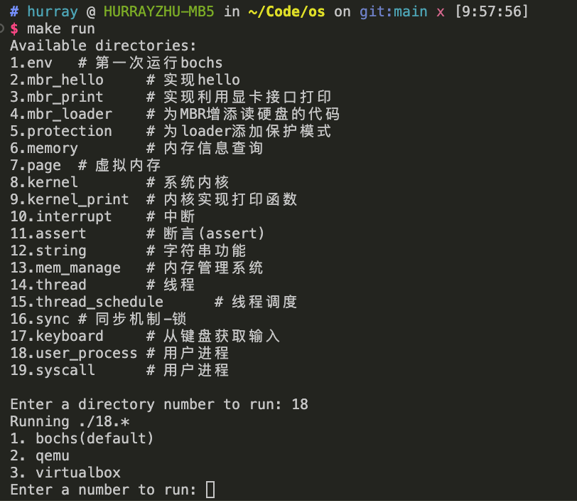

# manualOS
Hand made Operating System

Based on 《操作系统-真象还原》 郑钢 著

## 使用方法
每个数字开头的文件夹都是一个独立的项目，都可以进入子文件夹使用`make`编译，`make run`运行。

在根目录下执行`make`可以编译所有项目。执行`make run`会提示用户选择一个项目运行。
例如：


## 环境搭建的注意事项
### mac环境搭建
我这边使用的`bochs`为比较新的2.8版本，指令和2.6版本略有不同。
改动：
2.6: `bximage -hd -mode="flat" --size=60 -q hd60M.img`
2.8: `bximage -hd=60M -func="create" -q hd60M.img; fi`

除了按部就班安装`nasm`、`bochs`外，在使用c语言编写kernel时，MAC环境下的gcc不适用（M1芯片），需要安装`x86_64-elf-gcc`和`x86_64-elf-binutils`。
具体是：
```shell
brew install x86_64-elf-gcc x86_64-elf-binutils
```

此外，`bochs`的配置文件(`bochsrc.disk`)中图形界面的配置与linux下不同，mac下为：`display_library: sdl2`。linux下不用设置，使用默认的即可。

### linux环境搭建
linux下使用标准的`nasm`、`bochs`即可，不需要额外安装`x86_64-elf-gcc`和`x86_64-elf-binutils`。其中`bochs`的版本为2.8。

本项目做了linux环境下兼容（当前测试环境CentOS8）。
原理：在执行make时会根据`uname -a`判断系统环境，更新`Makefile`中的`CC`和`LD`变量。

## 进阶调试心得
> 在书中介绍了`bochs`的调试方法，但是遇到问题时如何找到程序报错的地方呢？以及如何知道c语言写的kernel的汇编代码及其对应的地址来方便打断点呢？

#### 1. 报错/不符合预期的地址如何查找？
* 对于进入死循环的程序，我们可以通过直接`Ctrl-C`中断程序，即可看到当前所在的汇编代码及其地址。
* 对于未知报错的程序，可以看到最后一条指令`t=?`处的时间点。通过执行`sba [值]-1`来以时间点断点，从而查看报错的地方。对于未知中断并进入死循环的程序，按照书中第9.4.2节的方法，可以使用`show extint`打印最后一个中断的值。

#### 2. 如何知道c语言写的kernel的汇编代码及其对应的地址？
* 我们可以使用`objdump -d kernel.bin > kernel.bin.asm`来查看kernel的汇编代码。这样生成的文件中，每一行都会有对应的地址(虚拟地址)。
* 对于汇编来说，我们在nasm编译时指定`-l mbr.bin.asm`即可生成对应的地址，但需要注意地址是以0开始的，而不会识别vstart标记的基址。

#### 3. 断点
* 对于mbr/loader，断点物理地址，直接使用`b [物理地址]`即可。
* 对于其他程序，断点虚拟地址，直接使用`lb [虚拟地址]`即可。

<!-- 从这行开始后面的内容为自动生成，请勿写内容 -->
## 项目列表
### 1.env - 第一次运行bochs
目录链接：[1.env](./1.env)

__PS.对应书中第0-1章__

这里执行找了一个打印字符串的例子，而不是书中会报错退出的例子。具体实现其实是`3.mbr_print`中利用直接写显存打印的方法。


### 2.mbr_hello - 实现hello
目录链接：[2.mbr_hello](./2.mbr_hello)

__PS.对应书中第2章__

开机启动时，从BIOS入口地址(0xFFFF0)跳转BIOS。BIOS会检测硬件，然后加载引导扇区(硬盘第0个扇区)到内存`0x7c00`处，然后跳转到`0x7c00`处执行引导扇区。
本章使用汇编，实现MBR的功能，即从`0x7c00`处开始执行的程序。
这里执行了一个打印的例子，原理是调用了0x10号中断.


### 3.mbr_print - 实现利用显卡接口打印
目录链接：[3.mbr_print](./3.mbr_print)

__PS.对应书中第3章第3.3节__

这里执行了一个打印的例子，原理是直接写显存（`0xB8000`+偏移）。


### 4.mbr_loader - 为MBR增添读硬盘的代码
目录链接：[4.mbr_loader](./4.mbr_loader)

__PS.对应书中第3章第3.6节__

在这里，我们将为MBR增添读硬盘的代码。
原理是使用硬盘的串行接口（寄存器`0x1F0`-`0x1F7`）读取硬盘的第二个扇区（`0x8000`）到内存(`0x900`)中。
并跳转到loader程序的入口地址执行。
将loader程序从硬盘的第二个扇区开始加载到内存中，并跳转到loader程序的入口地址（当前为`0x900`）执行。


### 5.protection - 为loader添加保护模式
目录链接：[5.protection](./5.protection)

__PS.对应书中第4章（保护模式入门）__

在这里，我们将为loader添加保护模式。由16位实模式切换到32位保护模式，为后续的内核做准备。

保护模式与实模式的主要不同在于，开启了全局描述符表（GDT）。
之后访问内存不在直接使用段基址+偏移量的方式（物理地址），而是使用段选择符（代替了段基址）+偏移量的方式。
通过GDT，我们可以实现更加灵活的内存管理。对不同的内存区域进行不同的访问权限控制。（例如`.text`段只读，`.data`段可读写等）


### 6.memory - 内存信息查询
目录链接：[6.memory](./6.memory)


__PS.对应书中第5章（保护模式进阶，向内核迈进）中的5.1节（获取物理内存容量）__

本章利用系统BIOS中断0x15来获取物理内存容量。具体有三种实现方式：
1. 通过BIOS中断0x15的功能0xe820来获取物理内存容量
2. 通过BIOS中断0x15的功能0xe801来获取物理内存容量
3. 通过BIOS中断0x15的功能0x88来获取物理内存容量


### 7.page - 虚拟内存
目录链接：[7.page](./7.page)

__PS.对应书中第5章（保护模式进阶，向内核迈进）中的5.2节（启用内存分页机制，畅游虚拟空间）__

在32位保护模式下，实现二级页表（页目录项和页表项）的初始化，以及开启分页机制。

当前页目录项在内核中的基址为`0x100000`，第一个页表项在内核中的基址为`0x101000`。
通过写入`cr3`控制寄存器，开启分页机制。


### 8.kernel - 系统内核
目录链接：[8.kernel](./8.kernel)

__PS.对应书中第5章（保护模式进阶，向内核迈进）中的5.3节（加载内核）__

使用C语言写内核，当前在内核中实现了一个死循环，没有其他功能。

汇编实现32位保护模式下的内核加载（读硬盘并拷贝到内存`0x70000`处，并跳转到内核入口地址(虚拟地址`0xc0001500`)执行）。

本章开始需要注意`MacOS`和`Linux`环境的异同。

通过以下命令可以将内核放置在指定的内存位置(`0xc0001500`)：
```shell
$(LD) -m elf_i386 -Ttext 0c0001500 -e main -o build/kernel.bin build/main.o
```


### 9.kernel_print - 内核实现打印函数
目录链接：[9.kernel_print](./9.kernel_print)


__PS.对应书中第6章（完善内核）__

在汇编中实现`put_char`、`put_str`、`put_int`的打印函数，原理是直接写显存。
需要注意的是，对于换行符、回车符、退格符等特殊字符的处理，以及光标的移动等问题。

此外学习了如何在C语言中调用汇编函数。二者能互相调用的原理是都会被编译成二进制代码。


### 10.interrupt - 中断
目录链接：[10.interrupt](./10.interrupt)


__PS.对应书中第7章（中断）__

通过实现中断描述符表（IDT）和中断服务程序，我们可以处理外部中断和异常中断。

将IDT基址写入`IDTR寄存器`，使得CPU能够找到IDT。发生中断时，CPU会根据中断号在IDT中查找中断描述符，然后根据中断描述符中的中断服务程序入口地址跳转到中断服务程序。


### 11.assert - 断言(assert)
目录链接：[11.assert](./11.assert)


__PS.对应书中第8章（内存管理系统）中的8.2节（实现assert断言）__

本章没有什么好说的，就是使用c语言的宏定义来实现断言功能。
当条件不满足时，会触发断言，打印出文件名、行号、条件等信息。


### 12.string - 字符串功能
目录链接：[12.string](./12.string)


__PS.对应书中第8章（内存管理系统）中的8.3节（实现字符串操作函数）__

本章实现了类似`<string.h>`中的函数功能，例如`memset`/`memcpy`/`memcmp`/`strcpy`/`strlen`/`strcmp`/`strchr`/`strrchr`/`strcat`/`strchrs`等。

本章需要注意的是：
* 使用`char str1[20]`定义字符串时的注意事项（string测试用例）
在macOS下gcc编译`char str11[20]`的用法会使用movdqa、movups命令，这两个指令在bochs中会报错。因此需要在g++编译时加上`-mno-sse`参数。


### 13.mem_manage - 内存管理系统
目录链接：[13.mem_manage](./13.mem_manage)


__PS.对应书中第8章（内存管理系统）中的8.5（内存管理系统）__

通过位图的实现，来判断内存的使用情况。

内存分配需要申请连续的虚拟内存，按1页大小申请物理内存，然后将虚拟内存和物理内存进行映射。


### 14.thread - 线程
目录链接：[14.thread](./14.thread)


__PS.对应书中第9章（线程）中的9.3节__

本章还未进行线程调度，只是实现了主线程到新线程栈空间的切换，并进入新线程执行。

需要实现PCB（进程控制块）和线程栈的保存。在线程执行时修改栈指针`esp`，使其指向新线程的栈空间。


### 15.thread_schedule - 线程调度
目录链接：[15.thread_schedule](./15.thread_schedule)


__PS.对应书中第9章（线程）中的9.4节（多线程调度）__

通过时间器（检测`0x20`端口的中断）来实现线程调度。当当前线程时间片（`ticks`，每次reset等于优先级`prio`）用完时，触发时钟中断，调用`schedule`函数进行线程切换。


### 16.sync - 同步机制-锁
目录链接：[16.sync](./16.sync)


__PS.对应书中第10章（输入输出系统）中的10.2节（用锁实现终端输出）__


### 17.keyboard - 从键盘获取输入
目录链接：[17.keyboard](./17.keyboard)


__PS.对应书中第10章（输入输出系统）中的10.3节~10.5节__

本章实现了一个简单的键盘驱动程序，可以从键盘获取输入。键盘驱动程序的主要功能是从键盘获取输入，然后将输入的字符存储在一个缓冲区中。当用户按下键盘上的某个键时，键盘控制器会产生一个中断信号，然后键盘驱动程序会从键盘控制器中读取输入的字符，并将其存储在缓冲区中。

在main中，我们创建了两个消费者线程用来消费键盘输入。


